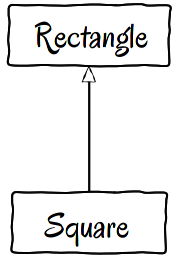

### 2021-04-15

# Liskov Substitution Principle(LSP)
[SOLID: Part 3 - Liskov Substitution & Interface Segregation Principles](https://code.tutsplus.com/tutorials/solid-part-3-liskov-substitution-interface-segregation-principles--net-36710)
를 번역하여 내용을 정리해보았다.

> 자식 클래스는 절대로 부모 클래스의 타입 정의를 위반해서는 안된다

1987년 컨퍼런스 키노트에서 Liskov가 소개했고, 추후애 1994년 Wing이 paper를 퍼블리시했다. 기존의 정의는 다음과 같다:

> type T의 객체 x일때, q(x)의 프로퍼티가 보장된다고 가정하면, T의 자식 타입인 S타입의 객체 y에 대해 q(y)는 항상 보장되어야 한다.

나중에 로버트 마틴의 의해 SOLID원칙 중 하나로 포함되었다. 로버트 마틴은 다음과 같이 정의한다.

> 자식클래스는 부모타입과 치환가능해야만 한다.

간단하게, 자식클래스는 클라이언트의 관점에서 기능을 꺠지않는 방향으로 부모 클래스의 메소드를 오버라이드 해야한다.간단한 예시는 다음과 같다

```java
class Vehicle {

    public void startEngine() {
        // Default engine start functionality
    }
 
    public void accelerate() {
        // Default acceleration functionality
    }
}

class Car extends Vehicle {
 
    @Override
    public void startEngine() {
        engageIgnition();
        super.startEngine();
    }
 
    private void engageIgnition() {
        // Ignition procedure
    }
 
}
 
class ElectricBus extends Vehicle {
    @Override
    public void accelerate() {
        increaseVoltage();
        connectIndividualEngines();
    }
 
    private void increaseVoltage() {
        // Electric logic
    }
 
    private void connectIndividualEngines() {
        // Connection logic
    }
 
}

//Client
class Driver {
    public void go(Vehicle v) {
        v.startEngine();
        v.accelerate();
    }
}
```


OCP법칙에서 보았듯이, 리스코프 법칙은 OCP법칙과 큰 의존관계를 가지고 있다. 사실, LSP규칙 위반은 OCP법칙의 숨어있는 위반이며, 템플릿메소드디자인패턴은 LSP를 지키며 구현한 전형적인 예시이며, OCP를 만족하는 방식이기도 하다.

## 전형적인 LSP위반



```java
class Rectangle {
    private int width;
    private int height;
 
    public void setHeight(int height) {
        this.height = height;
    }
 
    public int getHeight() {
        return this.height;
    }
 
    public void setWidth(int width) {
        this.width = width;
    }
 
    public int getWidth() {
        return this.width;
    }

    public int area() {
        return this.width * this.height;
    }
}

class Square extends Rectangle {
 
    public void setHeight(int value) {
        this.width = value;
        this.height = value;
    }
 
    public void setWidth(int value) {
        this.width = value;
        this.height = value;
    }
}

class Client {
 
    pulic void areaVerifier(Rectangle r) {
        r.setWidth(5);
        r.setHeight(4);
 
        if(r.area() != 20) {
            throw new Exception('Bad area!');
        }
 
        return true;
    }
}
```

현실에서는 정사각형은 직사각형의 일부분이라 상속을 고민해볼만 하다.

하지만, 실제 square로 상위 클래스를 대체하게 되었을 때, 메소드의 결과 값이 변화하게 된다.

참고자료

[SOLID : 리스코프 치환 원칙](https://pizzasheepsdev.tistory.com/9)

[SOLID: Part 3 - Liskov Substitution & Interface Segregation Principles](https://code.tutsplus.com/tutorials/solid-part-3-liskov-substitution-interface-segregation-principles--net-36710)
