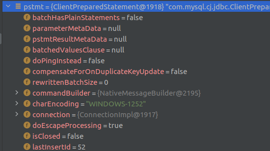

### 2021-04-16

# try-with-resourcse Statement
[try-with-resources oracle-docs](https://docs.oracle.com/javase/tutorial/essential/exceptions/tryResourceClose.html)를 번역하여 정리
try-with-resources의 경우 하나 이상의 resource를 try문에 선언하는 것이다. `resource`는 프로그램이 끝났을 때, 닫혀야 하는 객체를 말한다. statement끝에 각각의 resource 들이 닫힌다. java.lang.AutoCloseable 또는 java.io.Closeable을 implements한 모든 객체는 resource로 사용될 수 있다.

file의 첫 줄을 읽어오는 것이 다음 예시이다.
```java
static String readFirstLineFromFile(String path) throws IOException {
    try (BufferedReader br =
                   new BufferedReader(new FileReader(path))) {
        return br.readLine();
    }
}
```

BufferReader 인스턴스가 try-with-resource구문으로 구현됬기 떄문에, 정상 또는 비정상적으로 구문이 완료 되는 것과 관계 없이 리스소가 클로즈 된다.

JAVA SE 7전까지는 finally블록으로 직접 resource를 클로즈 해줘야한다. 다음과 같다.

```java
static String readFirstLineFromFileWithFinallyBlock(String path)
                                                     throws IOException {
    BufferedReader br = new BufferedReader(new FileReader(path));
    try {
        return br.readLine();
    } finally {
        if (br != null) br.close();
    }
}
```

이 예제들의 경우 차이점이 하나 있는데, finallyBloack메소드의 경우 readLine, close 둘다 Exception이 발생한 경우 finally block에 exception만 throw되고(try block은 무시됨), try-with-resource구문의 경우에는 try block의 에러만 throw되고 try-with-resource block의 경우에는 무시된다. JAVA SE 7 and Later에서는 suppress된 exception을 재생산해낼 수 있다.

하나 이상의 리소스를 선언 할 수도 있다.

```java
public static void writeToFileZipFileContents(String zipFileName,
                                           String outputFileName)
                                           throws java.io.IOException {

    java.nio.charset.Charset charset =
         java.nio.charset.StandardCharsets.US_ASCII;
    java.nio.file.Path outputFilePath =
         java.nio.file.Paths.get(outputFileName);

    // Open zip file and create output file with 
    // try-with-resources statement

    try (
        java.util.zip.ZipFile zf =
             new java.util.zip.ZipFile(zipFileName);
        java.io.BufferedWriter writer = 
            java.nio.file.Files.newBufferedWriter(outputFilePath, charset)
    ) {
        // Enumerate each entry
        for (java.util.Enumeration entries =
                                zf.entries(); entries.hasMoreElements();) {
            // Get the entry name and write it to the output file
            String newLine = System.getProperty("line.separator");
            String zipEntryName =
                 ((java.util.zip.ZipEntry)entries.nextElement()).getName() +
                 newLine;
            writer.write(zipEntryName, 0, zipEntryName.length());
        }
    }
}
```

Note: try-with-resources 구문도 기존의 try 구문 처럼 catch와 finally를 가질 수 있다. try-with-resources 구문에서는 선언된 resources들이 종료된 이후 catch와 finally 구문이 실행된다.

### Suppressed Exception
Throwable.getSuppressed method를 호출하면 exception을 retrieve할 수 있다.


# MySQL last_insert_id
체스 게임 과정 중 마지막 방을 생성하고, 바로 그 방으로 redirect를 하고 싶었다. 그러기 위해선 roomId가 필요했다.
roomId를 직접 보여주는 방식이 조금 위험할 수도 있다고 생각하지만, 우선 이 방법으로 진행한다. room table의 정보는 다음과 같다.
```sql
CREATE TABLE room
(
    room_id   SERIAL,
    room_name VARCHAR(30) NOT NULL,
    PRIMARY KEY (room_id)
);
```


처음 생각해낸 방법은, roomName으로 입력 받은 방을 다시 순회하면서 찾는 방법이다. 하지만, room_name의 중복이 허용되야 하는 구조라 생각이 들었다. 그렇다고 room_id를 정렬하고 마지막 값을 구한다? 이 구현도 별로다.

킹 갓 코기가 요런것도 있다고 알려줬다.
SELECT last_insert_id();
그렇다 이것은 마지막 insert한 id를 가지고 있는 것이다.!



디버깅을 해봤을 때, pstmt 에 lastInsertId 가 들어있는 것을 확인할 수 있다.
어떻게 해서 pstmt2가 이 정보를 가지고 가는지는 아직은 잘 모르겠다.

조심해야할 부분은 이 connection 내부에서 이러난 insert의 마지막 id라는 점이다.